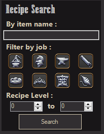
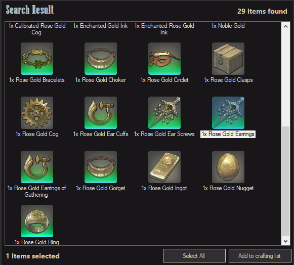
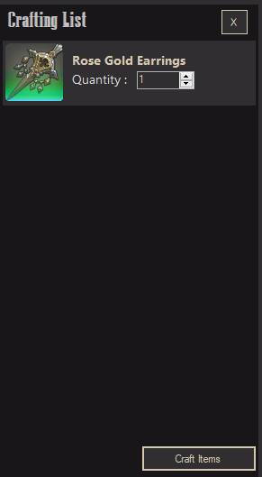
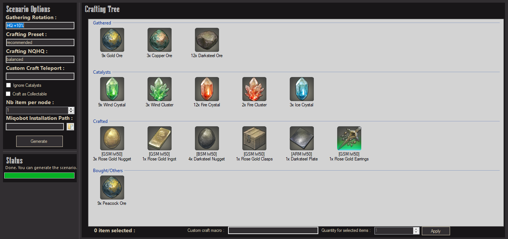
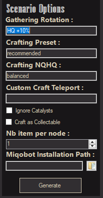
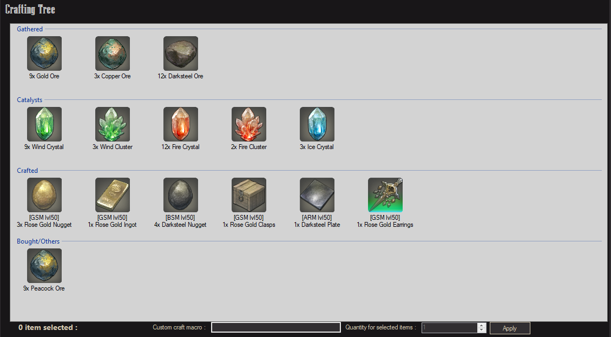

## MiqoCrafter - Miqobot automated script generation

Welcome to the MiqoCrafter GitHub!

### What is MiqoCrafter ?

I just wanted to share with you all a tool I made.
It’s call Miqocrafter (You’ll see the reference) and it has one goal : simplify your crafter/gatherer life.

Basically, this is a scenario generator.
You just have to search for an item name, and it will generate a complete crafting scenario, including the gathering of needed items.

### How does it work ?

Easy ! 

Open MiqoCrafter, you will see this search window:

Simply enter a [partial] item name in the search field at the top, define your search filter by job or item level, and click “Search”.

The list of found item will be displayed on the right.

Select the item you want to craft in the list, and click “Add to Crafting List”.
The crafting list will be filled with the selected item. You can edit the item quantities, and when you're done, click on Craft Items.

Another window will pop up. After some time (watch the progress bar on the bottom left), you’ll see all the necessaries ingredients displayed in the list.

You can customize the scenario using the options on the left side:

- *Gathering Rotation*
This is the default gathering rotation used in the scenario. It must contain the name of a gathering rotation you have set up in miqobot, or that is inside the CacheRotations/Rotations.txt file.
See https://miqobot.com/forum/forums/topic/help-crafting/ for more info.

- *Crafting Preset*
Default crafting behavior used by miqobot.

- *Crafting NQ/HQ*
Miqobot crafting solver balance between HQ and NQ output. Default is balanced.

- *Custom Craft Teleport*
Teleport location used right before starting the crafting chapter of teh scenario. Use it if you want to teleport to a quiet place before crafting. You can also add a sub scenario right after this custom teleport if you add a custom scenario in the CustomTeleport directory.
If your teleport location is "MyZone", you can add a "MyZone Scenario.txt" and a "MyZone Grid.txt" files in the CustomTeleport directory. The grid will be added to the scenario data, and the scenario file content will be added to the global scenario, right after the teleport line.
You can use this feature to actually enter your house for example.

- *Ignore Catalysts*
Catalysts such as crystals/shards/... will nto be gathered if you activate this option

- *Craft as collectable*
Final craft will be done as a collectable if you activate this option

- *Nb Item Per Node*
This allows miqocraft to know how many nodes you need to gather the required number of items.
For example, if you need 9 items, and you set this value to 4, miqocrafter will gather on 3 nodes. If you set this value to 2, it will gather on 5 nodes.
It is recommended you adjust this value based on the gathering rate of the nodes. For 100%, 4 is OK. 75%, 3 is OK.

- *Miqobot Installation Path*
Use this to set your miqobot folder path. It will allow miqocrafter to avoid duplicating the resources name, which generates warning for miqobot.

On the crafting tree on the right, you can modify the number of items, and for crafted items you can set a specific craft macro.
The craft macro must be already created in miqobot.
See https://miqobot.com/forum/forums/topic/help-crafting/ for more info.
Just select one or several items, enter a craft macro name, or edit the quantity and click Apply. The quantity will be adjusted.

Click on “Generate” and bam, you’ll get a complete miqobot-compatible scenario for your item.

See https://miqobot.com/forum/forums/topic/beta-scenario-scripting-engine/ for more info on miqobot scenarios and those options values.

### Looks nice ! What’s behind ?

The list of ingredients and crafting steps are found from http://garlandtools.org/. That’s the easy step.
Then the hard part is the gatheriing scenario.
If you played already with miqobot, you know that a gathering scenario needs a good grid. And this is where I’ll need you.

### You need us ?

Yeah !
Basically for each gathered item, Miqocrafter will look in his subfolder CacheGrid if a corresponding grid exists.
If not, it will browse miqobot forum to try to get one.(From https://miqobot.com/forum/forums/topic/index-gathering-grids/).
Problem is, all of those grid are not “good” grid for Miqocrafter.

### Huh ? What’s a “good” grid ?

A good grid will tell Miqocrafter where to teleport, and must also include a path from the teleport location to the gathering nodes.
In the description, there should be the zone + aetheryte name specified using the following format :
[Zone @Aetheryte Name]

For example :
[Yanxia @Namai]
[Lower La Noscea @Moraby Drydocks]

From this format, Miqocrafter will know where to teleport.

### So I understand that, what can we do ?

Well I’m making the grid myself when I need them, and I’ve only made a few so far.
The good news is that pretty much all gathering node level 70+ are usually in the good format (Thanks Timrai)
For the others, you may want to manually edit the grid (description and grid paths/beacon/…) so they are in the good format.
If you’re kind enough to do so, first you’ll get an automated scenario for yourself, but also please send the grid to me so I can add it to the default software.
That way everyone can use them.
In the end, that’s what will make this tool really useful.

### Any other things we need to know ?

Yeah, you can customize the generated scenario, if you have customized gathering rotation/solver preset.
Just add the gathering rotation text file into CacheRotations directory, and solver preset in CacheSolverPresets.
You can also cutsomize the gathering presets in CacheGatheringPresets.

### What’s next ?

This is a software I intended to make for myself, then realized it could help everyone out.
For now I’m planning on adding more customization, as well as testing more scenarii when I need them (this daily GC stuff is going to help me out).
As a final goal, I’d like the software to generate a full scenario to craft all items. I want those shiny crafting tools !
But if you have other suggestions, tips, rotation proposal, … use this github !

I hope you’ll enjoy this little piece of software, and help me/us out with all those grids 🙂

